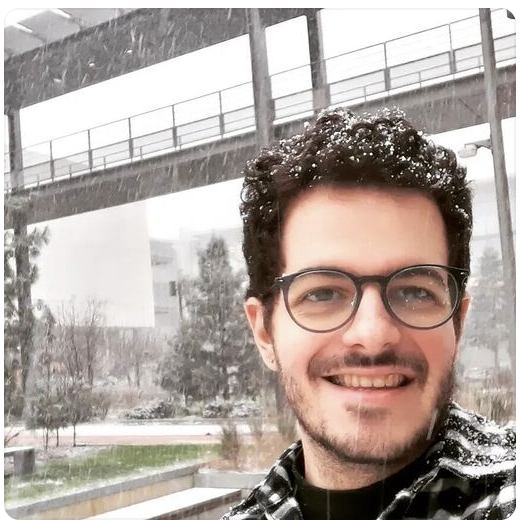

    

        
    

    

        <h2>Dr. Stephanie Noble</h2>
        
Principal Investigator

        
<a href="https://cos.northeastern.edu/psychology/">Dr. Stephanie Noble</a> is an Assistant Professor in the <a href="https://cos.northeastern.edu/psychology/">Department of Psychology</a>, <a href="https://bioe.northeastern.edu/">Department of Bioengineering</a>, and <a href="https://web.northeastern.edu/cbhlab/">Center for Cognitive and Brain Health</a> at <a href="https://www.northeastern.edu/">Northeastern University</a> where she focuses on creating tools to facilitate more precise human neuroscience inference and prediction. Her research lies at the intersection of data science, neuroscience, and open science. Specifically, her work has addressed open questions and introduced new paths forward to facilitate more reliable and valid neuroimaging studies, and paves a way towards improving individual-level models of behavior and disease. Previously, Dr. Noble received a BS in Chemical & Biological Engineering from Princeton University, a PhD in the Interdepartmental Neuroscience Program at Yale University, and completed Postdoctoral training in Radiology & Biomedical Imaging at Yale. Beyond academia, she co-founded EEG startup goBlue Labs and served a consultant for Source Signal Imaging (now part of Cortech Solutions) and Elite Warrior Identification. Dr. Noble’s work has been supported by a number of awards, including from the NSF and NIH, and her work has appeared in various journals including PNAS, Nature, and Neuron.
         <i><a href="/img/SMN_CV.pdf">Curriculum Vitae</a></i>
        

    

    

        
    

    

        <h2>Alex Fischbach</h2>
        
PhD Candidate

        
Alex Fischbach is a sixth-year PhD candidate whose research focuses on measurement precision and data-driven method development for functional brain imaging (fMRI). She graduated from Providence College (PC) in 2017 with dual B.A. degrees in Psychology and Biology and a certificate in Neuroscience. During her undergraduate training, she conducted research at both PC and Brown University, investigating the neurobiological, environmental, and genetic antecedents of Body Dysmorphic Disorder and disorders of anxiety and fear. She earned her M.S. (2020–2023) while working with Dr. Lisa Feldman Barrett and Dr. Karen Quigley in the Interdisciplinary Affective Science Lab, where her research examined how brainstem and subcortical structures, traditionally associated with ‘fight-or-flight’ responses, support everyday cognitive functions such as working memory in the absence of threat. In the NeuroPRISM Lab, Alex is developing a scalable, Python-based artifact correction pipeline designed to identify and remove local physiological noise in deep brain regions, thereby enabling more precise and reliable estimates of neural activity in the subcortex. Alex is expected to graduate in 2026 and is open to opportunities in both academia and industry. To get in touch, please email her at alexkfischbach [at] gmail. com 

        

    Alex is expected to graduate in 2026 and is open to opportunities in both academia and industry. 
    To get in touch, please email her at alexkfischbach [at] gmail.com
    

    

    

        
    

    

        <h2>Hallee Shearer</h2>
        
PhD Student

        
Hallee is a PhD student interested in test-retest reliability, naturalistic neuroimaging, precision psychiatry, and statistics. She received a Bachelor of Science in Behavioural Neuroscience in 2021, and a Master of Science in Neuroscience in 2023 - both from the University of British Columbia (UBC). During her time at UBC, she worked with Dr. Fidel Vila-Rodriguez at the Non-Invasive Neurostimulation Therapies (NINET) lab, where her interest in the use of fRMI for interventional psychiatry began. She then joined the Naturalistic Neuroimaging Lab with Dr. Tamara Vanderwal to explore how movie-fMRI could provide improvements in functional connectivity test-retest reliability for precision psychiatric applications. In the NeuroPRISM lab, Hallee is currently working on creating a tool for exploring expected effect sizes of typical fMRI studies. 

    

    

        
    

    

        <h2>Dr. Fabricio Cravo</h2>
        
Postdoctoral Researcher

        
Fabricio Cravo is a Postdoctoral Researcher in the NeuroPRISM Lab specializing in computational and statistical analysis of fMRI data, particularly for more powerful study planning and inference. Dr. Cravo received his Master's degree in Computer Engineering from CentraleSupélec, France, with a specialization in AI, machine learning, and databases. He then completed his Ph.D. in Computer Science and Applied Mathematics at Paris-Saclay University (ranked #1 globally in Mathematics by ARWU, 2020-2023), where his research focused on distributed algorithms for microbiological systems and mathematical modeling of gene regulatory networks with continuous-time Markov and ordinary differential equations models. He is currently the lead developer of MobsPy, a programming language for biochemical reaction networks, and SHOCK, an empirical power MATLAB toolbox for fMRI studies that features optimized statistical algorithms.
         <i><a href="https://fabriciocravo.github.io">Personal Website</a></i>
        

    

