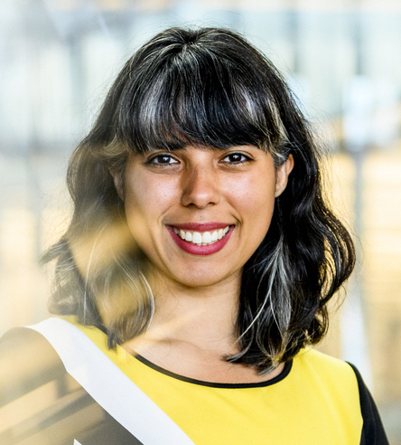

    

        
    

    

        <h2>Dr. Stephanie Noble</h2>
        
Principal Investigator

        
Dr. Stephanie Noble is an Assistant Professor in the Department of Psychology, Department of Bioengineering, and Center for Cognitive and Brain Health at Northeastern University where she focuses on creating tools to facilitate more precise human neuroscience inference and prediction. Her research lies at the intersection of data science, neuroscience, and open science. Specifically, her work has addressed open questions and introduced new paths forward to facilitate more reliable and valid neuroimaging studies, and paves a way towards improving individual-level models of behavior and disease. Previously, Dr. Noble received a BS in Chemical & Biological Engineering from Princeton University, a PhD in the Interdepartmental Neuroscience Program at Yale University, and completed Postdoctoral training in Radiology & Biomedical Imaging at Yale. Beyond academia, she co-founded EEG startup goBlue Labs and served a consultant for Source Signal Imaging (now part of Cortech Solutions) and Elite Warrior Identification. Dr. Noble’s work has been supported by a number of awards, including from the NSF and NIH, and her work has appeared in journals including PNAS, Nature, and Neuron.
         <a href="/img/SMN_CV_May_2024.pdf">CV</a>
        

    

    

        
    

    

        <h2>Alex Fischbach</h2>
        
PhD Candidate

        
Alex Fischbach is currently a 4th year graduate student and PhD Candidate in the Department of Psychology and Center for Cognitive and Brain Health at Northeastern University (NU). Her research is primarily centered on enhancing precision fMRI within the subcortex through the utilization of artifact removal techniques, with a particular emphasis on ultra-high resolution imaging (7-Tesla). She completed her undergraduate studies at Providence College (PC) in 2017, where she earned dual B.A. degrees in Psychology and Biology along with a certificate in Neuroscience. During her undergraduate tenure, she conducted research at both PC and Brown University, investigating the environmental and biological underpinnings of negative affect as seen in disorders of anxiety and fear. In 2020, Alex joined the Interdisciplinary Affective Science Lab (IASLab) at NU, under the mentorship of Dr. Lisa Feldman Barrett and Dr. Karen Quigley. Her work in the IASLab focused on exploring subcortical brain structures historically associated with ‘fight-or-flight’ circuits and characterizing their function in the absence of threat. Alex earned her M.Sc. from the IASLab in 2022. In 2023, Alex joined the NeuroPRISM lab, where her current focus is on investigating the impact of venous and cerebrospinal fluid artifact removal on test-retest reliability within the subcortex. More generally, Alex’s research is motivated by her passion for neuroanatomy and her desire to explore the nuances of methodological choices in functional neuroimaging, examining how they influence our understanding of neural phenomena and shape the trajectory of scientific inquiry.

    

    

        
    

    

        <h2>Hallee Shearer</h2>
        
Research Technician

        
Hallee is a research technician interested in test-retest reliability, naturalistic neuroimaging, precision psychiatry, and statistics. She received a Bachelor of Science in Behavioural Neuroscience in 2021, and a Master of Science in Neuroscience in 2023 - both from the University of British Columbia (UBC). During her time at UBC, she worked with Dr. Fidel Vila-Rodriguez at the Non-Invasive Neurostimulation Therapies (NINET) lab, where her interest in the use of fRMI for interventional psychiatry began. She then joined the Naturalistic Neuroimaging Lab with Dr. Tamara Vanderwal to explore how movie-fMRI could provide improvements in functional connectivity test-retest reliability for precision psychiatric applications. In the NeuroPRISM lab, Hallee is currently working on creating a tool for exploring expected effect sizes of typical fMRI studies. 

    

